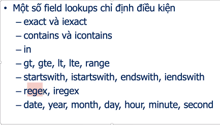

# 1. Some queries are used to retrieve database.
* `create()`: create a new object and save it into the database.
* `update()`: update an object.
* `delete()`: delete an object.
* `save()`: like commit, the object is saved into the database.
* `obj, created = get_or_create(default, **kwargs)`: find the object which you assign in the `kwargs` parameters. If the object existed in the database, this object is returned to `obj`, else this object is created and saved into the database and then returned to `obj` and `created` is assigned `True`.
  ```python
  t, created = Tag.objects.get_or_created(name="reactjs")
  ```
* `updated_or_created(default, **kwargs)`: too easy to understand as its name.
* `count()`:
* `latest()`: specific the field that you want to get. For example, the `Post` model has `created` field with its type is `DateTime`, and you want to get the latest `Post` based on the `created` field. In this case, you can use this method.
* `earliest()`: opposite to the `latest()` method.
  ```python
  Lesson.objects.earliest('created_date')
  ```
* `first()`:
* `last()`:
* `aggregate()`:
* `exist()`:
* `filter()`:
  ```python
  Lesson.objects.filter(<field>__<method>)
  ```
  Some popular methods are:
  * `iendswith`, `istartwith`, `month`, `year`, `day`, bla bla.
  * With datetime method like `year`, `month`,... we can use `__range=[a, b]` to specific the value in a valid range to want to filter. Or `__in=[a, b, c,...]`, `__gt`, `__lt`, `__lte`, `__gte`,...
* We can use method `query` to see SQL query after using `filter` method.
* Find out more at [https://docs.djangoproject.com/en/4.0/topics/db/queries/](https://docs.djangoproject.com/en/4.0/topics/db/queries/)
  
* `exclude`: remove records which you specific.
* Inside `filter()` method, if you have `,` it means you want to use `and` operator in SQL. `|` is `or` and `Q(<your query>)` to concatenate multiple queries.
* Lazy:
  

* `order_by`: get with sorting values.
  ```python
  Category.objects.all().order_by('name') # add subtract character in front of the name if want to decrease sorting
  ```

