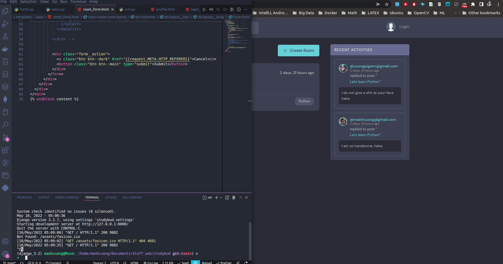

# 1. Description
* This is my naive version of Google classroom, its name is StudyBuddy.
* You can post the subject title, people can create their accounts and login to leave their comments and discuss about that subject.
* You can search the subject that you want to learn or discuss.
* Using SQLite3 database and Django.
  

# 2. Installation
* Clone or download as zip the entire repository, go to the directory `studybud`.
* Inside the directory `studybud`, open your terminal and create a new conda environment and then activate it.
  ```bash
  conda create --name studybud python==3.9.12 pip
  conda activate studybud
  ```

* Install some python packages by these commands:
  ```bash
  pip install -r requirements.txt
  ```

* Run Django server by this command:
  ```bash
  python manage.py runserver
  ```